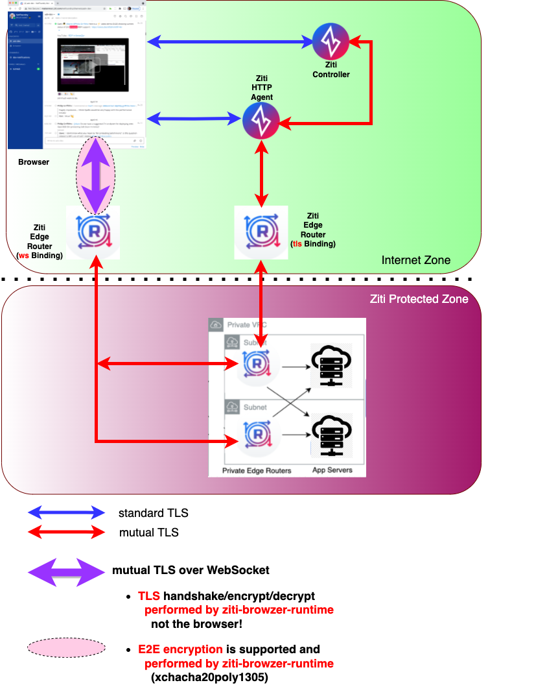

    <b>
    <a>@openziti/ziti-browzer-edge-client</a>
     
     
    <b>
    This component contains the JavaScript-based Ziti Edge REST client used as part of the OpenZiti browZer stack
    to communicate with the Ziti Control plane.  This Ziti Edge REST client
    can be used by a variety of other components that play a role in a <a href="https://ziti.dev/blog/zitification">Zitified</a> web app.</b>
     
     
    <b>Part of the <a href="https://ziti.devdev/about">OpenZiti</a> Zero Trust browZer stack</b>

     
    <b>Are you interested in knowing how to easily embed programmable, high performance, zero trust networking into your app, on any internet connection, without VPNs?
     
    Learn more about our <a href="https://ziti.devdev/about">OpenZiti</a> project by clicking the image below:</b>
     
     
    

---

---

<!-- TOC -->

- [Overview](#overview)
- [Features](#features)
- [Installation](#installation)
- [API](#api)
- [License](#license)

<!-- /TOC -->

## Overview 

More detailed explanation...coming soon... but meanwhile:  

The Ziti browZer environment allows
you to run a web app server in a private, dark-to-the-internet VPC, and _still_ allow your authorized
users to access it, _AND_ you do not need to make any modifications to your web app to accomplish this.

 

## Features

tbd

## Installation

tbd

## API

tbd

## License

Apache 2.0
